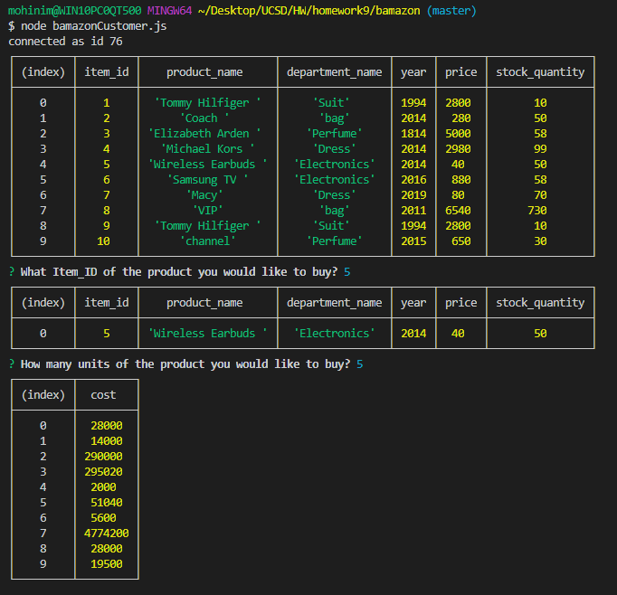
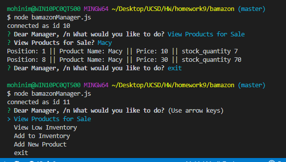
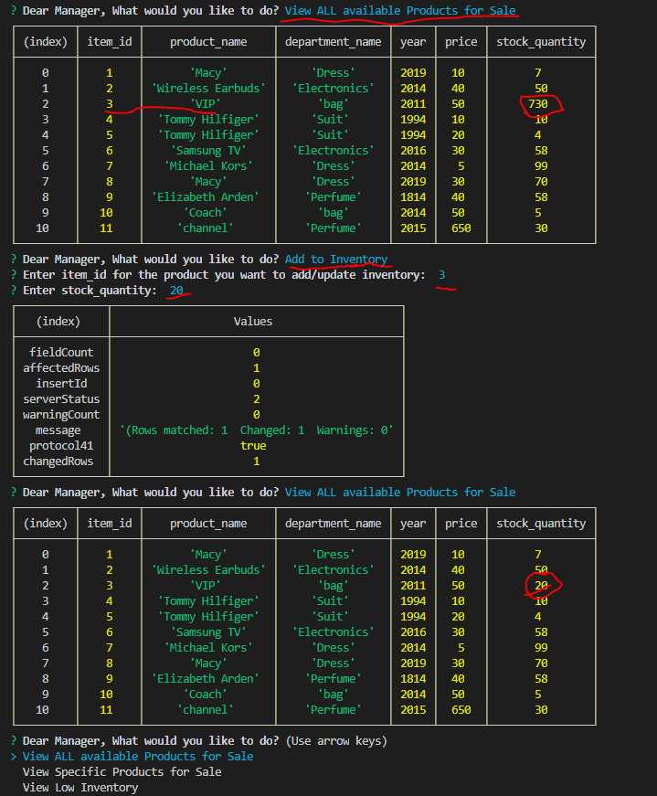
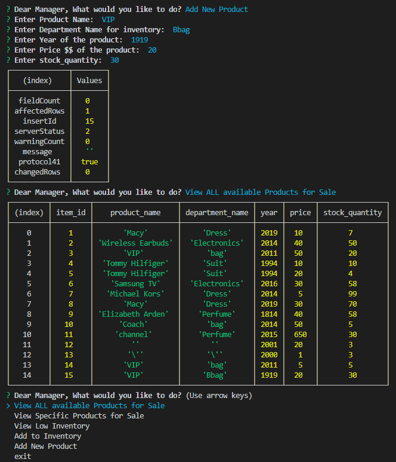

# bamazon
The app take in orders from customers and deplete stock from the store's inventory.  App also track product sales across the store's departments and then provide a summary of the highest-grossing departments in the store.

To run program make sure to install npm packages as mentioned below from bash terminal: 
* $ npm i
* $ npm init
* $ npm install mysql require inquirer

**Working functions snippit** :
* Bamazon Customer 

**Working functions snippit** :
* Bamazon Manager

**Working functions snippit** :
* Bamazon Manager Adding Inventory to the List of table from NodeJS to MySQL

**Working functions snippit** :
* Bamazon Manager Inserting New Row from NodeJS into MySQL Database

